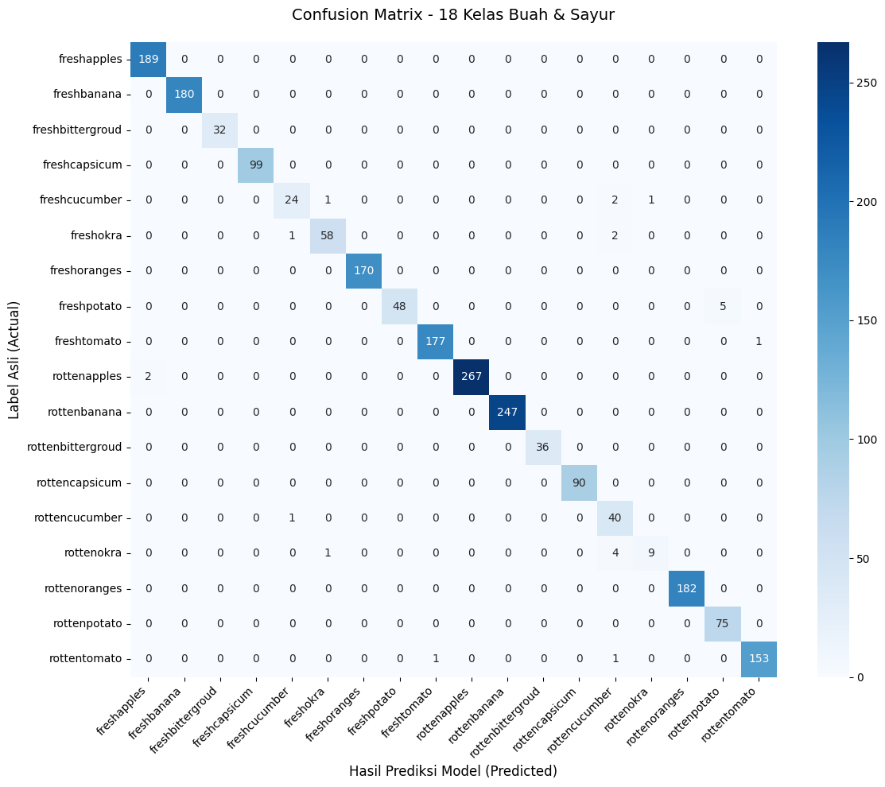

# 🍎 Model Machine Learning: Identifikasi Kesegaran Buah dan Sayur
Proyek ini merupakan model identifikasi kesegaran buah dan sayur yang dikembangkan menggunakan teknik *Machine Learning* dengan arsitektur **CNN MobileNetV2** melalui metode ***Transfer Learning***. Model ini dirancang untuk memproses input gambar komoditas dan memberikan klasifikasi mengenai nama komoditas serta status kesegarannya (Segar atau Tidak Segar).
## Deskripsi Proyek
Model ini menggunakan pendekatan *Deep Learning* untuk membedakan kategori buah dan sayur. Prototipe ini telah dilatih menggunakan dataset dengan rincian sebagai berikut:
| No | Aspek | Total | Deskripsi |
| :--- | :--- | :--- | :--- |
| 1 | **Kelas** | 18 | *freshapples, freshbanana, freshbittergroud, freshcapsicum, freshcucumber, freshokra, freshoranges, freshpotato, freshtomato, rottenapples, rottenbanana, rottenbittergroud, rottencapsicum, rottencucumber, rottenokra, rottenoranges, rottenpotato, rottentomato.* |
| 2 | **Gambar** | 30.357 | Total seluruh gambar yang digunakan untuk proses pelatihan dan validasi. |
| 3 | **Komoditas** | 9 | *Apples, Banana, Bittergroud, Capsicum, Cucumber, Okra, Oranges, Potato, Tomato.* |
## Dataset
Keseluruhan dataset yang digunakan dalam pengembangan model ini bersumber dari [Kaggle: Fresh and Stale Classification](https://www.kaggle.com/datasets/swoyam2609/fresh-and-stale-classification). 
## Hasil & Evaluasi (Uji Kualitas)
Model mencapai akurasi keseluruhan sebesar **99%** pada data pengujian. Berikut adalah rincian metrik performa model:
| Kelas | Precision | Recall | F1-Score | Support |
| :--- | :---: | :---: | :---: | :---: |
| freshapples | 0.99 | 1.00 | 0.99 | 189 |
| freshbanana | 1.00 | 1.00 | 1.00 | 180 |
| freshbittergroud | 1.00 | 1.00 | 1.00 | 32 |
| freshcapsicum | 1.00 | 1.00 | 1.00 | 99 |
| freshcucumber | 0.92 | 0.86 | 0.89 | 28 |
| freshokra | 0.97 | 0.95 | 0.96 | 61 |
| freshoranges | 1.00 | 1.00 | 1.00 | 170 |
| freshpotato | 1.00 | 0.91 | 0.95 | 53 |
| freshtomato | 0.99 | 0.99 | 0.99 | 178 |
| rottenapples | 1.00 | 0.99 | 1.00 | 269 |
| rottenbanana | 1.00 | 1.00 | 1.00 | 247 |
| rottenbittergroud | 1.00 | 1.00 | 1.00 | 36 |
| rottencapsicum | 1.00 | 1.00 | 1.00 | 90 |
| rottencucumber | 0.82 | 0.98 | 0.89 | 41 |
| rottenokra | 0.90 | 0.64 | 0.75 | 14 |
| rottenoranges | 1.00 | 1.00 | 1.00 | 182 |
| rottenpotato | 0.94 | 1.00 | 0.97 | 75 |
| rottentomato | 0.99 | 0.99 | 0.99 | 155 |
| **Accuracy** | | | **0.99** | **2099** |

## Seberapa Pintar Model Ini? (Hasil Uji)
Model ini sangat pintar, dengan tingkat keberhasilan mencapai **99%**. Berikut penjelasan sederhana mengenai cara membaca hasil tesnya:
* **Accuracy (Akurasi):** Seberapa sering model menjawab dengan benar secara keseluruhan. Jika akurasinya 99%, berarti dari 100 foto, model berhasil menebak 99 foto dengan tepat.
* **Precision (Ketepatan):** Saat model menebak "Apel ini segar", apakah tebakannya benar? Nilai tinggi berarti model jarang salah klaim (jarang menyebut buah busuk sebagai buah segar).
* **Recall (Kejelian):** Seberapa jago model menemukan semua buah segar di tumpukan? Nilai tinggi berarti model hampir tidak pernah melewatkan buah segar yang ada.
* **F1-Score (Nilai Gabungan):** Ini adalah skor gabungan untuk memastikan model tidak hanya teliti, tapi juga jeli dalam mengenali buah secara keseluruhan.
* **Support:** Jumlah foto yang dipakai saat tes. Semakin banyak foto, semakin terpercaya hasil tesnya.

## Confusion Matrix
Gambar di bawah ini menunjukkan detail tebakan model. Warna atau angka tertinggi yang berkumpul di garis diagonal/miring menandakan bahwa tebakan model sudah sangat akurat.

## Struktur Folder
Berikut adalah penjelasan singkat mengenai isi dari repositori ini:
* **`Models/`**: Berisi file `FileModelFresee.ipynb` yang menyimpan arsitektur dan bobot model hasil pelatihan.
* **`Notebooks/`**: Berisi file `Fresee.ipynb`, yaitu kode utama untuk proses pelatihan model (*training*).
* **`README.md`**: Dokumentasi proyek ini.
* **`Requirements.txt`**: Daftar pustaka (*library*) Python yang dibutuhkan untuk menjalankan program.
* **`confussionmatrix.png`**: Visualisasi hasil pengujian untuk melihat seberapa akurat model dalam memprediksi setiap kelas buah dan sayur.

## Cara Kerjanya di Aplikasi
1. **Di Server (Pusat Data):** Model AI "duduk" di server. Saat ada kiriman foto dari HP, server akan memproses foto tersebut dan memberikan hasil (contoh: "Jeruk - Segar").
2. **Di Aplikasi HP:** Pengguna cukup memfoto buah, aplikasi akan mengirim foto tersebut ke server, dan hasil pengecekan akan langsung tampil di layar HP.

## Panduan untuk implementasi
Jika tim *cloud* ingin menjalankan model ini di server, berikut adalah langkah-langkah yang perlu disiapkan:
#### 1. Persiapan Lingkungan (*Environment*)
* Pastikan server sudah terinstal Python versi 3.x.
* Instal semua kebutuhan pustaka dengan menjalankan perintah: `pip install -r Requirements.txt`.

#### 2. Menyiapkan Model
* Model hasil pelatihan yang sudah siap digunakan berada di dalam folder `Models/`.
* Tim dapat memuat model tersebut ke dalam API (seperti Flask atau FastAPI) menggunakan perintah `tf.keras.models.load_model()`.

#### 3. Proses API (*Backend*)
* Server harus menyediakan *endpoint* yang menerima foto (format *Multipart Request*).
* Foto wajib diubah ukurannya (*resize*) menjadi 224x224 piksel agar sesuai dengan kebutuhan model.
* Hasil prediksi dalam bentuk JSON akan dikirimkan kembali ke aplikasi *mobile*.
